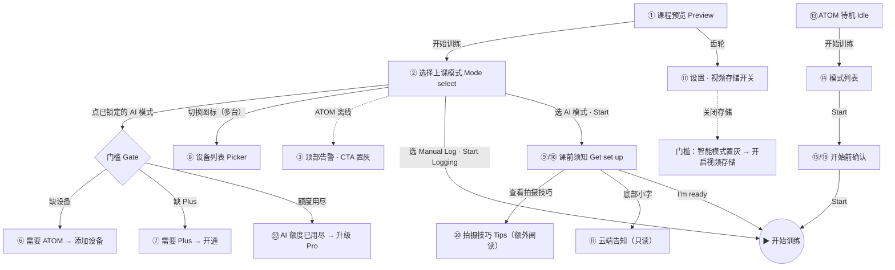
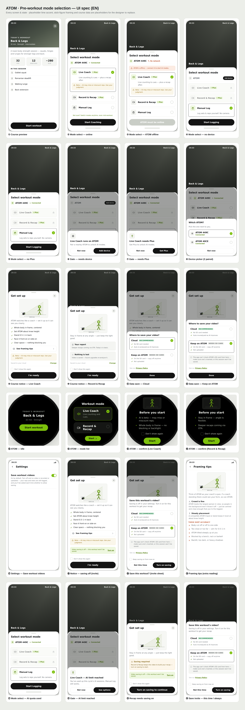
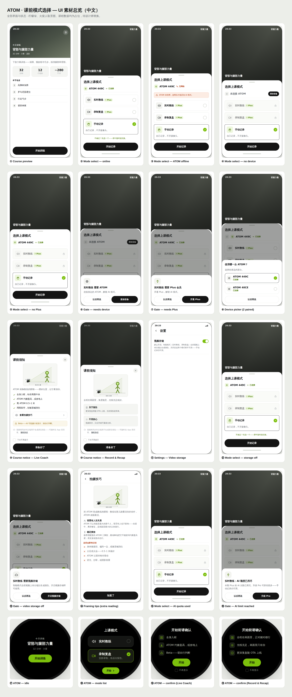

# PRD · 课前上课模式选择弹窗

**Pre-Workout Mode Selection Modal**

| 项 | 内容 |
|---|---|
| 版本 Version | v3 (Draft) |
| 状态 Status | 设计讨论中 · In review |
| 负责 Owner | Alexis Lin |
| 关联 | `Demo UX 交互原型.html`（可交互原型 · 手机 + ATOM 双端 · 预览优先）· `Code Flutter/`（代码实现）· `Demo UX 素材图/`（`UI-spec-en/zh.png` 全 20 屏素材 + `flow-board.png` 流程图）· `Tips 识别准确度指南.md` · `README.md` |
| 规格 Spec | iPhone 17 逻辑尺寸 **402×874pt**；App 字号统一 **20 / 16 / 14 / 12**（标题 / 名称·区块·按钮 / 正文 / 标注）；灰阶 + 单一品牌绿点缀（`#7CC00C` 占位）。 |

---

## 1. 背景 · Background

用户在开始一节课程前，需要选择用**哪种模式**上课。产品同时是一个**智能硬件（ATOM）+ App 双端**的形态，不同用户、不同设备/会员状态下能用的能力不同。原有的课前选择存在几个问题：

- 模式之间的**价值差异**表达不清，用户不知道该选哪个；
- 没有清楚说明哪些模式**依赖 ATOM 硬件 / Plus 会员**；
- 没有对 **AI 能力的边界（Beta）** 做合理预期管理；
- 硬件端与 App 端的选择体验**不统一**。

本弹窗即为解决上述问题的课前决策入口。

---

## 2. 目标 · Goals

本弹窗承载 **5 个核心目的**：

| # | 目的 | 说明 |
|---|---|---|
| G1 | **告知不同场景的选择** | 存在几类典型用户场景（被带练 / 只记录看报告 / 纯手动记账），需让用户一眼分清并知道怎么选。 |
| G2 | **引导理解硬件支持** | 这是智能硬件设备，AI 相关能力依赖 ATOM 在场且在线；需让用户理解并正确连接。 |
| G3 | **提示会员状态属性** | AI 能力需 Plus 会员；需在模式上明确标注，并在未开通时引导。 |
| G4 | **建立对 AI 的合理预期** | AI 处于 Beta，可能漏计/误计；开始前需提示，避免用户误解与投诉。 |
| G5 | **说明双端同步** | 手机端与 ATOM 端任一发起课程，都要经过同样的模式选择与确认。 |

### 非目标 · Non-goals
- 不在本弹窗处理**课中异常**（如中途 ATOM 掉线降级到手动记录）。
- 不处理**低电量 / 固件升级**（不作硬卡点）。
- 不在开始前做**权限**硬拦截（如上传录像权限，解耦到进入 Record & Recap 后按需申请）。

---

## 3. 用户场景 · User scenarios（对应 G1）

| 场景 | 诉求 | 推荐模式 |
|---|---|---|
| 新手 / 想被带着练 | 每一下都要实时计数、动作提示、反馈 | **Live Coach** |
| 进阶 / 不想被打扰 | 只管练，练完看影像、数据与报告 | **Record & Recap** |
| 纯记账 / 无设备 | 手动记录组数次数重量即可 | **Manual Log** |

---

## 4. 设计方案 · Design

### 4.0 入口：预览优先 · Preview-first

模式弹窗**不是一进来就弹**——两端都先落在一个「课程预览」：

- **手机端**：先展示**课程预览页**（课程封面 + 标题 + 时长/动作数/预估消耗 + 动作清单），底部「**开始训练**」按钮点击后**才**上滑弹出模式弹窗。
- **ATOM 端**：先展示**待机课程卡**（课程名 + 时长/类型 + 「开始训练」），点击后**才**进入模式列表。逻辑与手机端一致。

（预览页的课程数据为占位示例，接真实课程数据即可。）

**进出与返回逻辑（防呆 · 层层可退，无死角）**：整条链路是**逐层弹窗**，每一层都能明确退回上一层，不出现「进去出不来」。

| 层 | 进入 | 退出 / 返回 | 说明 |
|---|---|---|---|
| 课程预览 → **选择模式** | 点「开始训练」（上滑） | 点弹窗上方**暗化的课程背景**即退回预览 | 选择模式是预览之上的**底部弹窗**（带抓手条）；之前**缺少**这个退出，已补上 |
| 选择模式 → **门槛弹窗**（锁定 AI 模式） | 点已锁定卡片 | 点背景 / 「以后再说」 | 缺设备 / 缺 Plus / 额度用尽 / 视频存储关闭 四种 |
| 选择模式 → **课前须知**（Get set up） | 点「开始指导 / 开始录制」 | 右上角 **✕** / 点背景 / 下拉 | 均**取消返回选择模式**，不启动 |
| 课前须知 → **拍摄技巧** | 「查看拍摄技巧」 | 左上 **‹ 返回** | 整页二级阅读 |
| 课前须知底部 | 一行**只读**云端告知（+ 隐私协议链接） | —（无「更改」入口） | 视频强制上云，不再让用户选存储 |
| 课前须知 → **开始训练** | 「准备好了 / I'm ready」 | —（**前进**，非返回） | 唯一的前进出口 |

> 复核结论：唯一缺失的是**「选择模式」这一层的退出**——用户点空白无法回到预览。已补：点弹窗上方**暗化课程背景**即退回课程预览（与「课前须知」弹窗的退出手势一致）。其余各层退出/取消/返回均已存在且一致。

### 4.1 三种模式（方向：具名 3 选 1 + 可切换心智）

**结构决策**：保留**具名 3 选 1**（而非"AI + 能力开关"的排列组合式）。理由——课前是"营销/第一印象"时刻，具名卡片**决策与理解成本最低**，Record & Recap 也能独立曝光；开关式更灵活但偏"高阶用户配置"，理解成本更高。3 选 1 唯一的短板"像选了改不了"，用**一句心智提示**补齐：

> 「**不确定？先选一个——课中随时能切换。**」

**位置与样式**：放在**三张卡片下方、主按钮上方**；为**友好的绿色小字**（不加色块/描边/图标），弱化存在感。**只在 AI 模式真正可用时才展示**（配对 + Plus + 在线）；无设备 / 无 Plus / 离线时**自动隐藏**——此时只有 Manual Log 可选，「随时切换三种模式」会自相矛盾。

**模式心智原则（易懂优先）**：目标是让用户快速建立「实时带练 / 只录制看报告 / 纯手动」这个**三档心智**，但**不做成复杂配置**。落地手法：① 具名卡片、一句话说明；② 未选中只留标题，选中才展开一行（信息渐进）；③「课中随时能切」降低决策压力；④ 命名沿一条**直觉光谱**：实时驱动 → 自动 → 全手动。**不引入**开关矩阵 / 多层设置，避免"配置感"。

> 备选结构（已探索、暂不采用）：D 能力开关、E 两开关+独立手动、C 具名+开关、A 单开关。若未来能力增多或跟练课上线，可再评估切换到开关式。

| 模式 | 一句话 | 依赖 | 图标 |
|---|---|---|---|
| **Live Coach** 实时教练 | 实时计数与动作提示，**练后同样有复盘报告** | ATOM + Plus | 线形·声波 |
| **Record & Recap** 录制复盘 | 安静录制、**无实时动作提示**，练后出复盘报告 | ATOM + Plus | 线形·摄像机 |
| **Manual Log** 手动记录 | 手动记录组数、次数与重量 | 免费 | 线形·手+笔 |

> **重要（避免误解）**：Live Coach **是 Record & Recap 的超集**——它既有实时带练，**也包含**课后的录制与复盘报告。两者都出复盘；差别只在**有没有实时动作提示**（Live Coach 有，Record & Recap 无）。文案必须让用户明白「选 Live Coach 不会失去复盘」。因此模式说明写成对比式：Live Coach =「实时 + 练后复盘」，Record & Recap =「只录制、无实时动作提示，练后复盘」。

**交互（降低认知负载）**：未选中的卡片**只显示标题**（图标 + 名称 + `Plus` 标签），不带说明；**选中后才展开**一行说明，Live Coach 另在其下展示 `Beta` 提示。（原「Best for 适合谁」已删除，避免与说明重复。）

### 4.2 硬件与会员门槛（对应 G2 / G3）

- 两个 AI 模式标题旁带 **`Plus`** 会员小标签。
- 未满足门槛 → 该模式**置灰锁定**，点击弹**说明弹窗**，**页面不放常驻横幅**，保持干净。门槛有四档原因（按优先级 设备 › 会员 › 额度 › 存储）：
  - **无设备** → 引导添加设备；
  - **无 Plus** → 引导开通 Plus；
  - **有 Plus 但 AI 额度用尽**→ 弹窗「{模式}：AI 额度已用尽 · 本期 Plus 的 AI 次数已用完，升级 Pro 获得更多；手动记录仍可用」+ CTA **「升级 Pro」**（Pro 的具体价格/额度上限待商业确定）。
  - **视频存储关闭**（全局隐私开关关掉时）→ 弹窗「{模式} 需要视频存储 · 智能模式会把视频上传云端生成报告，开启视频存储即可使用」+ CTA **「开启视频存储」**。详见 §4.4。
- Manual Log 永远可用（无门槛、无额度、无存储要求）。

### 4.3 设备与网络状态（对应 G2）

手机**只能判断 ATOM 是否联网**，无法判断距离 → **没有「不在附近」检测**，改为柔性提示（并入开始前确认）。

| 配对 | ATOM 状态 | 行为 |
|---|---|---|
| 未配对 | — | AI 锁定，引导添加设备 |
| 单台 | 在线 | 可启动 |
| 单台 | 无网络 | **拦截启动**（ATOM 离线无法提供影像支持）：顶部告警「ATOM 未联网，连网后才能启动 AI 模式」+ CTA 置灰「ATOM 需在线」 |
| 多台 | — | 设备行前置**切换图标 → 弹列表**二次选择，默认保留当前激活设备，列表顶部提示「**选择你身边的那台**」（一部手机可配多台 ATOM，类比 iPhone ↔ 多块 Apple Watch）|

### 4.4 课前须知（对应 G4）

启动任一 **AI 模式**先弹出**高度自适应的「课前须知」底部弹窗**（Manual Log 无摄像头，不进）。内容**按模式区分**：

- **形态**：底部弹窗，**高度随内容自适应**（内容少则短、不留空白；超过屏幕 90% 才封顶并内部滚动，按钮始终固定在底部）。上方留出**暗化的课程背景**。
- **进出（防呆）**：顶部抓手条 +**右上角 ✕ 关闭**；点暗化背景、下拉、或 ✕ 均可**取消返回选择模式**（不启动任何东西）。底部「**准备好了 / I'm ready**」是**确认并开始训练**（前进到训练页，不是返回）。

**通用**
- **AI 提示在上**，页面主体是摆位/须知；底部是一行**只告知不给选**的云端提示（见下）——不让用户每次为存储/隐私纠结。
- **取景示意图**：一个人完整站在 **ATOM 取景框**内、脚踩地面线、四周留安全边距（火柴人为占位，**正式版用矢量插画**——非实拍照片，由设计师出一套「正确 vs 错误」矢量对照图）。
- **只放正向、精简**：Live Coach = 一张 OK 图 + 4 条「做到」+「查看拍摄技巧」入口；**反例 / 易错移到二级「拍摄技巧」页**（4 条，详见下），不在课前堆负面信息。
- **视频存储 = 只告知、不让选（改版 · 2026-07-22 会议）**：产品策略「尽到提示告知义务，但不让你改」。
  - **智能模式强制上云**：Live Coach 与 Record & Recap 的报告依赖云端分析，视频**默认且强制**上传云端。课前**不再提供「云端 / 仅存 ATOM」的存储位置选择**，也没有「更改」入口、没有二次弹窗。
  - **课前只留一行小字告知（精简）**：「视频加密存到您的云端账户，练后随时回看复盘。」+「隐私协议」链接（**「加密」已由工程/安全团队确认落地**）。隐私提示仍「恰到好处」——不做强承诺、不暗示拿视频训练，只给政策入口。
  - **本地 SD 与 App 解耦**：本地自动录制是 **ATOM 端自己的原生开关**（默认开、插卡才生效），App 不同步、不接管，课前不处理。存不存本地跟这一行无关（也因此不再有「无法确认 SD 卡」提示）。
  - **Record & Recap 不再有「需开启保存」分支**：云端强制开 ⇒ 它一定有视频与复盘报告，课前须知直接展示报告/留存说明，CTA 恒为「准备好了」。
  - **全局「视频存储」隐私开关 = 保留接口、本版不给关**：本版**默认开启、不提供用户关闭入口**；设置里「视频存储」为**只读状态**（显示「已开启」+ 说明，无开关）。底层标志 + 门槛逻辑**保留**，等未来真要放开「禁用云端」时再挂上开关。
  - **一旦（未来）真的关闭 → 智能模式置灰 + 引导重开**：两个智能模式在选择页**直接置灰锁定**；点击弹「{模式} 需要视频存储 · 智能模式会把视频上传云端生成报告，开启视频存储即可使用」+ CTA「开启视频存储」。手动记录不受影响。这把「要么给视频、要么用不了智能模式」落成一个硬门槛（原型/代码里已实现并可演示）。
  - **「视频可手动删除」不放在课前告知**：删除是**事后管理**动作，放在课前「开始」时刻反而会**放大**存储/隐私顾虑、也拉长文案。删除能力应落在**视频/复盘库**（每条视频旁的删除入口）与**隐私协议**里；当前仅支持单条删除，批量删除后续迭代。
  - 相机权限是**另一层、更严格**的硬授权（首次训练弹窗，取消即退出），与此解耦、保持不变。
  - （后续迭代：本地 SD 视频异步上云分析；云端视频批量删除。）
- **「下次不再提示」**：弹窗内勾选，紧贴按钮上方；勾了以后点开始直接进入训练（用记住的数据偏好）。
- **视觉（仅 App）**：Action button 与选项卡片用**较小圆角**（锐利风格）；ATOM 设备端维持自身风格。
- **配色纪律**：强调色收敛为 **品牌绿（主）+ 单一警示色**。`Plus` 标签用**绿色系**（当前为占位，最终以业务设计师素材为准）；**琥珀色只保留给「注意/警告」**（如 Beta 提示），不再兼表「会员/高级」，避免语义打架。
- **ATOM 圆屏可读性**：圆屏在一两米外看，正文/标题**字号更大、每屏信息更少**（一句话 + 一个动作）。
- **转场**：拍摄技巧 / 设置等整页从课前须知弹窗**右侧推入**（有意的页面导航），与底部弹窗区分开。拍摄技巧页底部固定一个「知道了 / Got it」主按钮，方便直接返回须知（顶部返回箭头保留）。
- **弹窗即抽屉（关键）**：所有底部弹窗——模式选择、课前须知、门槛/设备列表——都是**从底部整体上滑**的抽屉，**不是淡入**。scrim（暗色遮罩）淡入、卡片 `translateY(100%)→0` 上滑（`cubic-bezier(.22,.61,.36,1)`，~300ms）。Flutter 端由 `showModalBottomSheet` 原生提供；HTML 原型用 `@keyframes sheetrise` 对齐。
- **微动效规范（克制、符合 iOS/Material 惯例）**：时长统一 **150–320ms**、标准缓动（`easeOut` / `cubic-bezier(.22,.61,.36,1)`）；底部弹窗用**上滑抽屉**（见上）；ATOM 圆屏「开始前确认」等非抽屉浮层用**淡入 + 轻微缩放沉降**；卡片展开用高度过渡；按钮按压 ~`scale(.97)`。**去掉过度动效**（锁定卡的强抖动已收敛为极轻提示，且不与门槛弹窗重复）。全局**尊重系统「减弱动态效果」**（`prefers-reduced-motion` / `MediaQuery.disableAnimations`）——只保留快速淡入，去掉位移/缩放。

> 精简原则：去掉与页面标题重复的小标题；bullet 尽量不折行；只在必要时呈现信息。

**Live Coach（对角度较敏感）**
- **心智**：把 ATOM 说成**教练的眼睛**——「教练站那儿能看清你的动作，ATOM 就能看清」。副标题用短版「ATOM 就像教练的眼睛，摆好位置让它看清你」。
- 课前须知只放**正向**：一张「✓ 正确」取景图 + **做到清单（精简为 4 条）**：
  - 全身入框、**居中**；
  - **ATOM 约膝盖高度最好**，但**放地面或你顺手的位置也行**（贴地广角设备，不会到胸高——原「chest height」为错误，已改）；
  - 离约 **0.5–1 米**；
  - 周围留空，**别被器械（卧推凳 / 深蹲架 / 杠铃）挡住**。
  - **角度不硬性列出**：正对、侧对**都 OK，不影响识别**；每个动作有个更「清爽」的角度，跟课中「按动作提示」摆即可，拉远/撤退的机位通常也没问题——不在课前清单里写死「正对/侧对」，避免让人以为选错角度会出问题。
- **「拍摄技巧」二级页**（须知上有「查看拍摄技巧」入口，避免课前堆负面信息）。**排版节奏统一为 ① 图 → ② 文字 → ③ 线框提示**，避免碎片感：
  - ① 顶部一张取景 OK 图；
  - ② 图下方是**纯文字**的教练心智（「教练站那儿能看清你的动作，ATOM 就能看清」），不再用绿色小框，减少打断；
  - ③ 最下方是**线框卡片**形式的提示：一个卡片合并「背景有人没关系 + 稳定摆放（三脚架）」，另一个卡片是「✗ 这些会影响识别」清单。
  - **课前须知页**同样改为**图在最上**（图 → 副标文字 → 做到清单 → 「查看拍摄技巧」→ Beta），与 Tips 页节奏一致。
  - **图片策略**：须知放 1 张 OK；Tips 页后续可放 OK vs 若干 Not-OK 对照（当前为占位火柴人）。
  - **识别主体**：ATOM **自动锁定画面中最大的角色**——所以背景里有其他人一般不影响，关键是你**居中、离得够近，是画面里最大的主体**。（这条也进详版 `Tips 识别准确度指南.md`。）
- **稳定摆放**（Tips 页）：推荐**配套 ATOM 三脚架/支架**，把设备平稳架在约膝盖高度。
- 课前要求可**按动作模板化**（地面动作 / 大跨步需要更大画面）。
- **Beta 提示**：可能漏/误计，请自行判断。

**Record & Recap（对角度较宽松）**
- 副标题把取景要求**一句带过**：**全程在画面里，角度随意，光线充足就好。**（不再单列清单——图 + 这句已足够。）
- **关于报告**：更深复盘将随 OTA 上线，当前报告较简单——管理预期。
- **不用担心**：视频留存，日后每次算法升级都能重新分析这段录像。

**ATOM 端**：**独立整屏**（不透明、无蒙层），带取景图 + 按模式的精简两句（Coach：Beta + 完整入框；Recap：全程在画面里 + 报告迭代）。**已去掉 × 关闭按钮**，通过底部 Start 进入、可勾选 **不再显示**。

> 详细版见 [`Tips 识别准确度指南.md`](Tips 识别准确度指南.md)，可用于帮助中心 / 首课引导 / 「查看详细 Tips」入口。

### 4.5 双端同步（对应 G5）

手机端与 ATOM 端**共享同一套模式与规则**；ATOM 端仅提供两个 AI 模式（Manual Log 留在手机端），标题为「Workout mode / 上课模式」，选项标题与说明分两行、**仅选中卡片显示说明**。任一端发起都会经过「选择模式 → 开始前确认」。

### 4.6 交互流程 · Interaction flow

编号对应 §5.1 文案清单与 `Demo UX 素材图/UI-spec-*.png`；整图见 `Demo UX 素材图/flow-board.png`。

**分步（触发 → 结果）**

| # | 页面 | 触发 | 结果 / 下一步 |
|---|---|---|---|
| ① | 课程预览 | 点「开始训练」 | 上滑弹出「选择上课模式」（**先不弹**）；右上角齿轮进设置 |
| ② | 选择模式 | 点未锁定卡 | 选中，CTA 变对应「开始…」；点锁定卡→⑥/⑦ 门槛；多台点切换→⑧ 列表 |
| ③ | ATOM 离线 | ATOM 无网 | 顶部告警 + CTA 置灰，拦截启动 |
| ⑥/⑦ | 门槛弹窗 | 点锁定卡 | 缺设备→添加设备；缺 Plus→开通；或「以后再说」 |
| ⑧ | 设备列表 | 切换图标 | 选身边设备，回弹窗 |
| — | Manual Log | 点「开始记录」 | 直接 ▶ 开始（不进须知） |
| ⑨/⑩ | 课前须知 | AI 模式点 CTA | 上滑抽屉，正向引导（Coach 4 条做到 + 拍摄技巧入口；Recap 副标 + 报告/留存）；✕/背景/下拉取消，「准备好了」开始 |
| ⑳ | 拍摄技巧 | 点「查看拍摄技巧」 | 二级页：教练心智 + OK 图 + 背景有人没关系 + 稳定摆放 + 会影响识别（4 条）；底部「知道了」返回 |
| ⑪ | 云端告知 | —（只读一行小字）| 「视频加密存到您的云端账户，练后随时回看复盘」+ 隐私协议；无「更改」、无二次弹窗 |
| — | 须知 | I'm ready | ▶ 开始训练 |
| ⑰ | 设置 · 视频存储 | 关掉「视频存储」 | 两个智能模式在选择页置灰 → 点击弹「需要视频存储 · 开启视频存储」门槛 |
| ⑬→⑭→⑮/⑯ | ATOM 待机→模式→确认 | 逐步 Start | 与手机端同规则；仅两个 AI 模式；确认独立整屏，可「不再显示」→ ▶ 开始 |

---

## 5. 关键文案 · Copy（EN / 中文）

> 已做一轮中英双语精简（只删冗余、不改语义）。以 `strings.dart` / 原型 `T` 为唯一改文案入口。

| 位置 | EN | 中文 |
|---|---|---|
| 标题 | Select workout mode | 选择上课模式 |
| 切换心智提示 | Not sure? Pick one — switch anytime, even mid-workout. | 不确定？先选一个——课中随时能切换。 |
| Live Coach 说明 | Live counting & form cues — plus a recap after. | 实时计数与动作提示，练后同样有复盘。 |
| Record & Recap 说明 | Records quietly, recap after — no live form cues. | 安静录制、无实时动作提示，练后出复盘。 |
| Manual Log 说明 | Log sets & reps yourself. No camera. | 自己记录，不开摄像头。 |
| Beta 提示 | Beta — AI may miss or miscount reps. Use your judgment. | Beta——AI 可能漏计或误计，请自行判断。 |
| 无网拦截 | ATOM is offline — connect it to start AI modes. | ATOM 未联网，连网后才能启动 AI 模式。 |
| 无网 CTA | ATOM must be online | ATOM 需在线 |
| 门槛·缺设备 | Live Coach runs on ATOM · Pair a nearby ATOM to unlock AI modes. | Live Coach 需要 ATOM · 连接身边的 ATOM，解锁 AI 模式。 |
| 门槛·缺会员 | Live Coach needs Plus · Get Plus to unlock AI modes. | Live Coach 需要 Plus · 开通 Plus，解锁 AI 模式。 |
| 课前须知·标题 | Get set up | 课前须知 |
| Coach 副标 | ATOM watches like a coach — set it up so it can see you clearly. | ATOM 就像教练的眼睛——摆好位置，让它看清你。 |
| Coach 做到（4） | Whole body in frame, centered · ATOM at knee height, or the floor · Stand 0.5–1 m back · Clear space — nothing blocking you | 全身入框，站在画面中央 · ATOM 约膝盖高，或放地上· 离 ATOM 0.5–1 米 · 周围留空，别被器械挡住 |
| Coach 反例（Tips 页，4） | Body cut off, off-center, or blocked by gear · Too close or too far (0.5–1 m) · ATOM tilted steeply up · Backlit, too dark, or heavy shadows | 身体被裁切、偏到一边或被器械挡住 · 太近或太远（0.5–1 米） · ATOM 过度仰角 · 逆光、过暗或阴影很重 |
| Tips · 背景有人没关系 | Crowd is fine · ATOM tracks the largest person in view, so background people won't throw it off — just be centred and biggest. | 背景有人没关系 · ATOM 只认画面里最大的那个人，背景有人也不影响——你居中、是最大的主体就行。 |
| Tips · 稳定摆放 | The ATOM tripod is the easy way to get it level at about knee height — recommended. A stand or box works too. | 推荐用配套的 ATOM 三脚架，最省事地把它平稳架到约膝盖高度；用支架或垫高也行。 |
| 教练心智 | Think of ATOM as your coach's eyes: if a coach standing there could see your form, so can ATOM. | 把 ATOM 想成教练的眼睛：教练站那儿能看清你，ATOM 就能看清。 |
| Recap 副标 | Stay in frame at any angle — just keep the light good. | 全程在画面里，角度随意，光线充足就好。 |
| 报告预期 | Deeper recaps coming via OTA. Today's is basic. | 更深复盘将随 OTA 上线，当前报告较简单。 |
| 算法留存 | Video is saved — future upgrades re-analyze it. | 视频留存，日后升级可重新分析。 |
| 数据·底部行 | Saved to your cloud · Change | 视频同步到云端 · 更改 |
| 数据·隐私（轻量入口） | See our · Privacy Policy | 详见 · 隐私协议 |
| SD 提示（非告警） | The app can't check ATOM's SD card from here — make sure one's inserted, or this session won't be saved. | App 端无法确认 ATOM 的 SD 卡状态——请自行确保已插卡，否则本次不会保存。 |
| ATOM 确认·Coach | AI is beta — may miss or miscount reps. · Whole body in frame — no blocking or backlight. | AI 仍是 beta，可能漏记或误记。· 全身入框，别遮挡、别逆光。 |
| ATOM 确认·Recap | Stay in frame — angle is flexible. · Deeper recaps coming via OTA. | 全程在画面里，角度随意。· 更深复盘随 OTA 上线。 |

---

## 5.1 文案清单 · Copy inventory（逐页 / per screen）

> 唯一改文案入口：`Demo UX 交互原型.html` 的 `T`（对应 Flutter `strings.dart`）。标注「占位」的为示例数据，待产品/设计替换。交互流程见 §4.6。

### ① 课程预览 Course preview
| 键 key | EN | 中文 |
|---|---|---|
| pvKicker | TODAY'S WORKOUT | 今日训练 |
| course（课程名·占位）| Back & Legs | 背部与腿部力量 |
| pvMeta（占位）| 32 min · Strength · Intermediate | 32 分钟 · 力量 · 进阶 |
| pvDesc（占位）| A lower-body strength session — squats, hinges and lunges for stronger legs and back. | 下肢力量训练——深蹲、髋铰链与弓步，练强腿部和背部。 |
| pvStat（占位）| 32 min · 12 exercises · ~280 kcal | 32 分钟 · 12 个动作 · ~280 千卡 |
| pvInc | In this session | 本节包含 |
| pvEx1–4（占位）| Goblet squat · Romanian deadlift · Walking lunge · Back extension | 高脚杯深蹲 · 罗马尼亚硬拉 · 行走弓步 · 背部伸展 |
| pvStart | Start workout | 开始训练 |

### ⑰ 设置 Settings
| 键 | EN | 中文 |
|---|---|---|
| settingsTitle | Settings | 设置 |
| setSaveTitle | Save workout videos | 保存训练视频 |
| setSaveBody | On by default. Turn off and no video is recorded or uploaded — your reps and stats are still logged, and you'll be asked each time whether to allow saving. | 默认开启。关闭后不再录制或上传任何视频——组数、数据仍会记录；每次训练会询问是否允许保存。 |

### ② 选择上课模式 Mode select
| 键 | EN | 中文 |
|---|---|---|
| selectMode | Select workout mode | 选择上课模式 |
| connected / nonet / add / noDevice | Connected / No network / Add device / No ATOM | 已连接 / 无网络 / 添加设备 / 未连接 ATOM |
| flexNote（绿色小字）| Not sure? Pick one — switch anytime, even mid-workout. | 不确定？先选一个——课中随时能切换。 |
| Live Coach（名/说明/CTA）| Live Coach / Live counting & form cues — plus a recap after. / Start Coaching | 实时教练 / 实时计数与动作提示，练后同样有复盘。 / 开始指导 |
| Record & Recap | Record & Recap / Records quietly, recap after — no live form cues. / Start Recording | 录制复盘 / 安静录制、无实时动作提示，练后出复盘。 / 开始录制 |
| Manual Log | Manual Log / Log sets & reps yourself. No camera. / Start Logging | 手动记录 / 自己记录，不开摄像头。 / 开始记录 |
| plus tag | Plus | Plus |
| warnNonet（离线告警）| ATOM is offline — connect it to start AI modes. | ATOM 未联网，连网后才能启动 AI 模式。 |
| switchHint | Or switch to an online device. | 或切换到在线设备。 |
| ctaBlocked | ATOM must be online | ATOM 需在线 |

### ⑥⑦ 门槛弹窗 Gate ｜ ⑧ 设备列表 Picker
| 键 | EN | 中文 |
|---|---|---|
| popDevT / popDevS / popDevBtn | {mode} runs on ATOM / Pair a nearby ATOM to unlock AI modes. / Add device | {mode} 需要 ATOM / 连接身边的 ATOM，解锁 AI 模式。 / 添加设备 |
| popPlusT / popPlusS / popPlusBtn | {mode} needs Plus / Get Plus to unlock AI modes. / Get Plus | {mode} 需要 Plus / 开通 Plus，解锁 AI 模式。 / 开通 Plus |
| cancel | Not now | 以后再说 |
| pickT / pickHint | Which ATOM? / Pick the one next to you. | 使用哪一台 ATOM？ / 选择你身边的那台。 |

### ⑨⑩ 课前须知 Get set up
| 键 | EN | 中文 |
|---|---|---|
| pageTitle / psOk / dontShow | Get set up / I'm ready / Don't show this again | 课前须知 / 准备好了 / 下次不再提示 |
| coachSub | ATOM watches like a coach — set it up so it can see you clearly. | ATOM 就像教练的眼睛——摆好位置，让它看清你。 |
| coachDo（4）| Whole body in frame, centered · ATOM at knee height, or the floor · Stand 0.5–1 m back · Clear space — nothing blocking you | 全身入框，站在画面中央 · ATOM 约膝盖高，或放地上· 离 ATOM 0.5–1 米 · 周围留空，别被器械挡住 |
| tipsLink | See framing tips | 查看拍摄技巧 |
| beta | Beta — AI may miss or miscount reps. Use your judgment. | Beta——AI 可能漏计或误计，请自行判断。 |
| recapSub | Stay in frame at any angle — just keep the light good. | 全程在画面里，角度随意，光线充足就好。 |
| reportH / report | Your report / Deeper recaps coming via OTA. Today's is basic. | 关于报告 / 更深复盘将随 OTA 上线，当前报告较简单。 |
| algoH / algo | Nothing is lost / Video is saved — future upgrades re-analyze it. | 不用担心 / 视频留存，日后升级可重新分析。 |
| recapNoSave（不保存时）| This workout won't be saved, so there's no recap report. | 本次不保存，将没有复盘报告。 |

### ⑪ 视频存储 Video storage（只告知，无选择 · 改版 2026-07-22）
| 键 | EN | 中文 |
|---|---|---|
| cloudNoticeBody / privacyLink（课前须知底部告知）| Video encrypted and saved to your cloud account — review your workout anytime. / Privacy Policy | 视频加密存到您的云端账户，练后随时回看复盘。 / 隐私协议 |
| 设置 · setSaveTitle / setStateOn / setSaveBody（只读，无开关）| Video storage / On / The smart modes (Live Coach, Record & Recap) save your video to the cloud so you can review your workouts afterward — that's why it stays on. Manual Log uses no video. | 视频存储 / 已开启 / 智能模式（实时教练、录制复盘）会把视频存到云端，方便你练后回看复盘，因此保持开启。手动记录不涉及视频。 |
| 存储关闭 gate | {mode} needs video storage / Smart modes upload your video to the cloud for the report. Turn on video storage to use them. / Turn on video storage | {模式} 需要视频存储 / 智能模式会把视频上传云端以生成报告。开启视频存储即可使用。 / 开启视频存储 |
| 额度用尽 gate（升级 Pro）| {mode} — AI limit reached / This cycle's Plus AI sessions are used up. Upgrade to Pro for more — Manual Log still works. / Upgrade to Pro | {模式}：AI 额度已用尽 / 本期 Plus 的 AI 次数已用完。升级 Pro 可获得更多——手动记录仍可用。 / 升级 Pro |

### ⑳ 拍摄技巧 Framing tips
| 键 | EN | 中文 |
|---|---|---|
| tipsTitle / tipsOk | Framing tips / Got it | 拍摄技巧 / 知道了 |
| coachLine | Think of ATOM as your coach's eyes: if a coach standing there could see your form, so can ATOM. | 把 ATOM 想成教练的眼睛：教练站那儿能看清你，ATOM 就能看清。 |
| coachDoH（OK 标）| Set up | 这样摆 |
| crowdH / crowd | Crowd is fine / ATOM tracks the largest person in view, so people in the background won't throw it off — just be centred and close enough that you're the biggest. | 背景有人没关系 / ATOM 只认画面里最大的那个人，背景有人也不影响——你居中、离得够近，是画面里最大的主体就行。 |
| tripodH / tripod | Steady placement / The ATOM tripod is the easy way to get it level at about knee height — recommended. A stand or box works too. | 稳定摆放 / 推荐用配套的 ATOM 三脚架，最省事地把它平稳架到约膝盖高度；用支架或垫高也行。 |
| coachAvoidH | These hurt accuracy | 这些会影响识别 |
| coachAvoid（4）| Body cut off, off-center, or blocked by gear · Too close or too far — aim for 0.5–1 m · ATOM tilted steeply up at you · Backlit, too dark, or heavy shadows | 身体被裁切、偏到一边，或被器械挡住 · 太近或太远——0.5–1 米最好 · ATOM 过度仰角对着你 · 逆光、过暗，或阴影很重 |
| perExH / perEx | Per exercise / Some moves (floor work, wide stances) need more room — just follow the on-screen guide for each. | 不同动作 / 部分动作（地面动作、大跨步）需要更大画面，按每个动作的屏幕提示调整即可。 |

### ⑬⑭⑮⑯ ATOM 圆屏 Device
| 键 | EN | 中文 |
|---|---|---|
| workoutMode | Workout mode | 上课模式 |
| atomCoachSub / atomRecapSub | Live counting and form cues. / Records quietly, reports after. | 实时计数、动作提示。 / 安静录制，练后出报告。 |
| rstart / rcT / rcDont / rcGo | Start / Before you start / Don't show again / Start | 开始 / 开始前 / 不再显示 / 开始 |
| rcCoach（3，图标行）| Whole body in frame · ATOM at knee height or on the floor · Beta — use your own judgment | 全身入框 · ATOM 约膝盖高，或放地上 · Beta——请自行判断 |
| rcRecap（3，图标行）| Stay in frame — front or side both fine · Good light, just you in view · Deeper recaps coming via OTA | 全程在画面里，正对侧对都行 · 光线充足，画面里只有你 · 更深复盘随 OTA 上线 |
| ATOM「开始前请确认」布局 | 圆屏太小，**不放取景插画**，改用 **3 条图标须知行**（图标：入框 person / 摆位 height / Beta warn；Recap 为 person / 光线 sun / 信息 info）| — |
| 待机 Idle | 复用预览的 pvKicker / course / pvMetaShort(32 min · Strength) / pvStart | 复用：今日训练 / 背部与腿部力量 / 32 分钟 · 力量 / 开始训练 |

---

## 6. 最新设计 UI · Latest design

**全界面素材图（24 个界面/状态 × 中英）**——供设计师核对文案与素材。流程编排见 `Demo UX 素材图/flow-board.png`：

**English**

**中文**

> 覆盖：课程预览 / 模式选择（在线·离线·无设备·无 Plus）/ 门槛弹窗（缺设备·缺会员）/ 设备列表 / 课前须知（Coach·Recap，含云端告知）/ ATOM（待机·模式列表·确认 Coach·确认 Recap）/ 设置（视频存储开关）/ 存储关闭门槛 / 拍摄技巧页。
> 火柴人取景图、柠檬绿、课程数据（32 分钟 / 12 动作 / 280 千卡 / 动作名）均为**占位**，待设计师替换。
> 交互版见 `Demo UX 交互原型.html`（手机 + ATOM 双端）。

---

## 7. 边界与空/极限状态 · Edge, empty & limit states

### 7.1 状态矩阵 · State matrix
| 维度 | 状态 | 处理 |
|---|---|---|
| 配对 | 未配对 / 单台 / 多台 | AI 锁定引导添加 / 正常 / 切换图标弹列表二次选择 |
| 网络 | 在线 / 无网络 | 可启动 / **拦截**并顶部告警、CTA 置灰 |
| 会员 | 有 / 无 Plus | 正常 / 锁定引导开通 |
| 手动记录 | 任意 | 永远可用，不依赖设备/网络/会员 |

### 7.2 空 / 0 状态 · Empty & zero states
| 场景 | 现状 | 处理 / 待办 |
|---|---|---|
| **无设备**（0 台） | 设备行显示「未连接 ATOM」+ 添加设备；两个 AI 模式灰化锁定；只有 Manual Log 可用 | ✓ **「课中随时能切」小字自动隐藏**（只有 Manual 时切换提示无意义）|
| **无 Plus** | AI 模式灰化，点击弹开通；只有 Manual | ✓ 同上，切换小字隐藏 |
| **本地 SD 卡** | App 不接管；本地录制是 ATOM 端自己的开关（默认开、插卡生效） | ✓ 与 App 解耦，课前不处理、不告警 |
| **全局关闭视频存储** | 两个智能模式在选择页**置灰锁定**；点击弹「需要视频存储 · 开启视频存储」；Manual 不受影响 | ✓ 硬门槛替代旧「反向引导」 |
| **课程无动作 / 数据缺失**（预览） | 预览的时长/动作/消耗、动作清单为占位 | ⏳ 接真实数据；**0 动作时应隐藏「本节包含」整块**（工程实现注意）|

### 7.3 极限状态 · Limit states
| 场景 | 现状 | 处理 / 待办 |
|---|---|---|
| **超长设备名** | 单行不换行，可能溢出 | ⏳ 加 `ellipsis` 截断 |
| **Record & Recap 英文名较长** | 窄屏 `Plus` 标签掉到标题下一行 | 可接受（已处理换行）|
| **超长课程名 / 动作名** | 预览标题、动作行可能折行/溢出 | ⏳ 限行 + `ellipsis` |
| **多台设备（>2）** | 原型仅演示 2 台 | ⏳ 设备列表需**可滚动** |
| **多台全部离线** | 顶部告警，无「切到在线设备」补充句 | ✓ |
| **离线 + 无 Plus 同时** | 门槛优先级：点锁定卡先弹「缺设备/缺 Plus」（设备优先）；离线告警仍显示但此时 AI 本就不可选 | ✓（告警无害，可后续按需抑制）|
| **状态中途变化被锁** | 选中项被锁 → 自动回退到可用模式（`_reconcile`）| ✓ |

**有意不在此处理 · Out of scope**：ATOM 低电量 / 固件升级（不硬卡）、Plus 课中到期、**课中** ATOM 掉线降级、权限申请（解耦到进入模式后再按需申请）、ATOM 设备端自身的离线态。

---

## 8. 待定 · Open questions

- **品牌绿**确切色值（原型内 `#7CC00C` 为占位近似值，待替换为 BodyPark 品牌色 + on-light 变体）。
- **取景插画**：需设计师出「正确 vs 错误」摆位对照图，替换现火柴人占位。
- **隐私协议**真实链接。
- **课程预览页**接真实课程数据（封面图、时长、动作清单、预估消耗）。
- 是否需要「连接中 / 配对中」过渡态。
- Record & Recap 英文名较长，窄屏下 `Plus` 标签会掉到标题下一行——是否可接受，或强制同行（会压小字号）。

**已确认（近几轮）**：预览优先入口；未选中卡片只留标题；切换心智提示移到卡片下方、**绿色小字、AI 不可用时（无设备/无 Plus/离线）自动隐藏**；课前须知只放正向 + 反例移到「拍摄技巧」二级页；**视频存储 = 智能模式强制上云、课前只告知不给选**（本地 SD 与 App 解耦；全局隐私开关关闭则智能模式置灰）；**ATOM 只认画面里最大的角色**（背景有人没关系）；取景改为 **ATOM 约膝盖高度 · 0.5–1 米**；字号统一 20/16/14/12；iPhone 17 尺寸。

---

> 说明：以上截图由交互原型 `Demo UX 交互原型.html` 渲染生成。
> Note: screenshots rendered from the interactive prototype.
