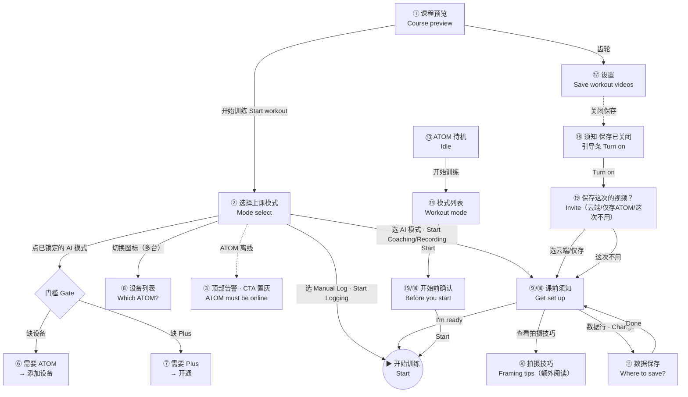

# 课前交互流程 · Pre-workout Interaction Flow

从「课程预览」到「开始训练」的完整交互，手机端与 ATOM 端双路径，含所有分支与状态。

> 关联：`PRD-课前模式选择.md`（含逐页文案清单）· `prototype-demo.html`（可交互）· `images/UI-spec-en.png` / `images/UI-spec-zh.png`（全 20 屏素材）· `images/flow-board.png`（本流程图）

---

## 1. 流程图 · Flowchart

---

## 2. 分步交互 · Step-by-step

### 手机端 Phone

| # | 页面 Screen | 触发 Trigger | 结果 / 下一步 Result |
|---|---|---|---|
| ① | 课程预览 Course preview | 进入课程 | 展示课程封面/统计/动作清单；**先不弹弹窗**。右上角齿轮进设置 |
| — | | 点「开始训练」 | 上滑弹出「选择上课模式」 |
| ② | 选择上课模式 Mode select | 弹窗出现 | 三张具名卡（未选中只留标题，选中展开一行说明）+ 设备行 + 切换提示（绿色小字；离线不显示）|
| — | | 点未锁定卡 | 选中该模式，CTA 变为对应「开始…」 |
| — | | 点已锁定卡（缺设备/缺 Plus）| ⑥/⑦ 门槛说明弹窗 |
| — | | 多台设备点切换图标 | ⑧ 设备列表二次选择 |
| ③ | ATOM 离线 | ATOM 无网 | 顶部红色告警 + CTA 置灰「ATOM 需在线」，拦截启动 |
| ④/⑤ | 无设备 / 无 Plus | 状态 | AI 模式置灰锁定，仅 Manual Log 可用 |
| ⑥/⑦ | 门槛弹窗 Gate | 点锁定卡 | 缺设备→添加设备；缺 Plus→开通 Plus；或「以后再说」|
| ⑧ | 设备列表 Picker | 切换图标 | 选择身边的设备，回到弹窗 |
| — | Manual Log | 点「开始记录」 | 直接 ▶ 开始（不进课前须知）|
| ⑨/⑩ | 课前须知 Get set up | AI 模式点 CTA | 整页；Coach=教练心智副标+OK图+5条做到+拍摄技巧入口+Beta；Recap=副标+OK图+报告/留存 |
| ⑳ | 拍摄技巧 Framing tips | 点「查看拍摄技巧」| 二级页：教练心智+OK图+稳定摆放(三脚架)+会影响识别(反例)+每个动作差异 |
| ⑪ | 数据保存 Data sheet | 点数据行「更改」| 云端(推荐)/仅存 ATOM(需SD)；无SD告警；隐私说明 |
| — | | 「下次不再提示」| 记住偏好，下次直接开始 |
| — | | I'm ready | ▶ 开始训练 |

### 全局设置与「不保存」反向引导 Settings & invert

| # | 页面 | 触发 | 结果 |
|---|---|---|---|
| ⑰ | 设置 Settings | 预览页齿轮 | 「保存训练视频」开关（默认开）|
| ⑱ | 须知·保存已关闭 | 关掉开关后进须知 | 数据行变绿色引导条「视频保存已关闭，本次不会保存 · 开启」|
| ⑲ | 保存这次的视频？ | 点「开启」| 正向弹窗：云端/仅存 ATOM + 底部「这次不用」；Recap 不保存则提示无复盘报告 |

### ATOM 端 Device

| # | 页面 | 触发 | 结果 |
|---|---|---|---|
| ⑬ | 待机 Idle | 设备待机 | 课程卡 + 「开始训练」|
| ⑭ | 模式列表 Workout mode | 点开始 | 仅两个 AI 模式，选中才显示说明 |
| ⑮/⑯ | 开始前确认 Before you start | Start | 独立整屏，取景图 + 按模式两句提示 + 「不再显示」 |
| — | | Start | ▶ 开始训练 |

---

## 3. 全部界面 · All screens

见 `images/UI-spec-en.png`（English）与 `images/UI-spec-zh.png`（中文）—— 20 屏一览；流程编排见 `images/flow-board.png`。

> 占位提醒：火柴人取景图、柠檬绿、课程数据（32 分钟 / 12 动作 / 280 千卡 / 动作名）、三脚架配件话术均为**占位**，待设计师 / 产品替换。

---

## 4. 关键规则回顾 · Rules recap

- 手机**只判联网**、不判距离 → 无「不在附近」；AI 模式需 ATOM **在线**才能起。
- **具名 3 选 1**；未选中只留标题；「课中随时能切换」= 绿色小字、卡下方、离线隐藏。
- **数据保存**默认不引导「不存」；「不保存」= Settings 全局开关；关掉后**每次反向引导去允许保存**。
- 课前须知**只放正向**；反例/易错 → 拍摄技巧二级页（按需阅读）。
- 双端共享同一套模式与规则；Manual Log 仅手机端。
