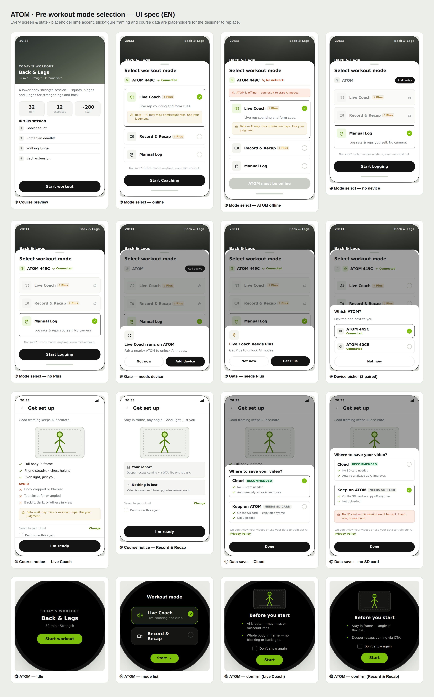
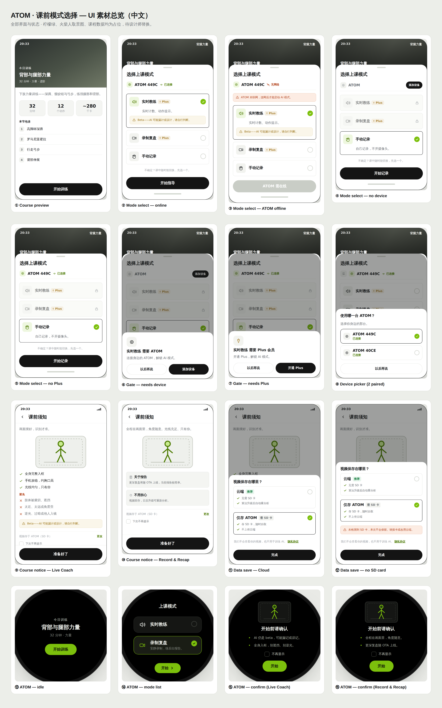

# PRD · 课前上课模式选择弹窗

**Pre-Workout Mode Selection Modal**

| 项 | 内容 |
|---|---|
| 版本 Version | v2 (Draft) |
| 状态 Status | 设计讨论中 · In review |
| 负责 Owner | Alexis Lin |
| 关联 | `prototype-demo.html`（左右双端 · 预览优先 · 主 demo）· `prototype-mobile.html`（手机满屏版）· `prototype-课前模式选择.html`（标注版）· `flutter/`（代码实现）· `images/UI-spec-en.png`·`images/UI-spec-zh.png`（全界面素材图）· `README.md` |
| 规格 Spec | iPhone 17 逻辑尺寸 **402×874pt**；App 字号统一 **20 / 16 / 14 / 12**（标题 / 名称·区块·按钮 / 正文 / 标注）；灰阶 + 单一品牌绿点缀（`#7CC00C` 占位）。 |

---

## 1. 背景 · Background

用户在开始一节课程前，需要选择用**哪种模式**上课。产品同时是一个**智能硬件（ATOM）+ App 双端**的形态，不同用户、不同设备/会员状态下能用的能力不同。原有的课前选择存在几个问题：

- 模式之间的**价值差异**表达不清，用户不知道该选哪个；
- 没有清楚说明哪些模式**依赖 ATOM 硬件 / Plus 会员**；
- 没有对 **AI 能力的边界（Beta）** 做合理预期管理；
- 硬件端与 App 端的选择体验**不统一**。

本弹窗即为解决上述问题的课前决策入口。

---

## 2. 目标 · Goals

本弹窗承载 **5 个核心目的**：

| # | 目的 | 说明 |
|---|---|---|
| G1 | **告知不同场景的选择** | 存在几类典型用户场景（被带练 / 只记录看报告 / 纯手动记账），需让用户一眼分清并知道怎么选。 |
| G2 | **引导理解硬件支持** | 这是智能硬件设备，AI 相关能力依赖 ATOM 在场且在线；需让用户理解并正确连接。 |
| G3 | **提示会员状态属性** | AI 能力需 Plus 会员；需在模式上明确标注，并在未开通时引导。 |
| G4 | **建立对 AI 的合理预期** | AI 处于 Beta，可能漏计/误计；开始前需提示，避免用户误解与投诉。 |
| G5 | **说明双端同步** | 手机端与 ATOM 端任一发起课程，都要经过同样的模式选择与确认。 |

### 非目标 · Non-goals
- 不在本弹窗处理**课中异常**（如中途 ATOM 掉线降级到手动记录）。
- 不处理**低电量 / 固件升级**（不作硬卡点）。
- 不在开始前做**权限**硬拦截（如上传录像权限，解耦到进入 Record & Recap 后按需申请）。

---

## 3. 用户场景 · User scenarios（对应 G1）

| 场景 | 诉求 | 推荐模式 |
|---|---|---|
| 新手 / 想被带着练 | 每一下都要实时计数、提示、反馈 | **Live Coach** |
| 进阶 / 不想被打扰 | 只管练，练完看影像、数据与报告 | **Record & Recap** |
| 纯记账 / 无设备 | 手动记录组数次数重量即可 | **Manual Log** |

---

## 4. 设计方案 · Design

### 4.0 入口：预览优先 · Preview-first

模式弹窗**不是一进来就弹**——两端都先落在一个「课程预览」：

- **手机端**：先展示**课程预览页**（课程封面 + 标题 + 时长/动作数/预估消耗 + 动作清单），底部「**开始训练**」按钮点击后**才**上滑弹出模式弹窗。
- **ATOM 端**：先展示**待机课程卡**（课程名 + 时长/类型 + 「开始训练」），点击后**才**进入模式列表。逻辑与手机端一致。

（预览页的课程数据为占位示例，接真实课程数据即可。）

### 4.1 三种模式（方向：具名 3 选 1 + 可切换心智）

**结构决策**：保留**具名 3 选 1**（而非"AI + 能力开关"的排列组合式）。理由——课前是"营销/第一印象"时刻，具名卡片**决策与理解成本最低**，Record & Recap 也能独立曝光；开关式更灵活但偏"高阶用户配置"，理解成本更高。3 选 1 唯一的短板"像选了改不了"，用**一句心智提示**补齐：

> 「**不确定？课中随时能切换，先选一个。**」

**位置与样式**：放在**三张卡片下方、主按钮上方**；为**纯灰色小字**（不加色块/描边/图标），弱化存在感。**ATOM 离线时不展示**这句（此时 AI 模式本就无法启动，提示会自相矛盾）。

> 备选结构（已探索、暂不采用）见 `explorations/`：D 能力开关、E 两开关+独立手动、C 具名+开关、A 单开关。若未来能力增多或跟练课上线，可再评估切换到开关式。

命名沿「AI 参与度」光谱：实时驱动 → 自动 → 全手动。

| 模式 | 一句话 | 依赖 | 图标 |
|---|---|---|---|
| **Live Coach** 实时教练 | 训练时实时计数并给出动作提示 | ATOM + Plus | 线形·声波 |
| **Record & Recap** 录制复盘 | 全程安静记录，练完给一份详细报告（云端） | ATOM + Plus | 线形·摄像机 |
| **Manual Log** 手动记录 | 手动记录组数、次数与重量 | 免费 | 线形·手+笔 |

**交互（降低认知负载）**：未选中的卡片**只显示标题**（图标 + 名称 + `Plus` 标签），不带说明；**选中后才展开**一行说明，Live Coach 另在其下展示 `Beta` 提示。（原「Best for 适合谁」已删除，避免与说明重复。）

### 4.2 硬件与会员门槛（对应 G2 / G3）

- 两个 AI 模式标题旁带 **`Plus`** 会员小标签。
- 未满足门槛（无设备 / 无 Plus）→ 该模式**置灰锁定**，点击弹**说明弹窗**（缺设备→添加设备；缺会员→开通 Plus），**页面不放常驻横幅**，保持干净。
- Manual Log 永远可用。

### 4.3 设备与网络状态（对应 G2）

手机**只能判断 ATOM 是否联网**，无法判断距离 → **没有「不在附近」检测**，改为柔性提示（并入开始前确认）。

| 配对 | ATOM 状态 | 行为 |
|---|---|---|
| 未配对 | — | AI 锁定，引导添加设备 |
| 单台 | 在线 | 可启动 |
| 单台 | 无网络 | **拦截启动**（ATOM 离线无法提供影像支持）：提示「请确保 ATOM 在线」 |
| 多台 | — | 设备行前置**切换图标 → 弹列表**二次选择，默认保留当前激活设备，列表顶部提示「**请选择在你身边的设备**」（一部手机可配多台 ATOM，类比 iPhone ↔ 多块 Apple Watch）|

### 4.4 课前须知页（对应 G4）

启动任一 **AI 模式**先进入**整页「课前须知」**（不是弹窗——内容多、弹窗显示不全；顶部返回 + 底部「准备好了」，可滚动。Manual Log 无摄像头，不进）。内容**按模式区分**：

**通用**
- **AI 提示在上**，页面主体是摆位/须知；数据选择**弱化到底部一行小字**——避免用户每次为隐私纠结（产品希望默认更多人上传云端）。
- **取景示意图**：一个人完整站在手机取景框内、脚踩地面线、四周留安全边距（火柴人为占位，正式版待设计师出「正确 vs 错误」对照插画）。
- **注意事项一律 3 条 bullet**（正/负各三条），精炼不赘述。
- **训练数据保存（底部小行 + 二次弹窗）**：
  - 底部只有一行小字显示当前选择（默认「视频将同步到你的云端账户」）+ 「更改」。点击才弹**二次小弹窗**做选择，降低决策成本。
  - **云端（推荐，默认）**：① 无需 SD 卡；② 算法升级后自动重新分析、结果自动刷新。用正向收益引导。弹窗内附**隐私说明**：「我们不会主动查看你的视频，也不会用你的数据训练 AI」+ **隐私协议**链接。
  - **仅存 ATOM**（标注 **需 SD 卡**）：视频存 ATOM 的 SD 卡，可自行拷走，不上传云端。
  - 选「仅存 ATOM」但**未检测到 SD 卡** → 告警「本次训练不会被保留」（当前为提醒，不硬拦）。
  - 选择会被**记住**作为偏好，不必每次重选。
- **「下次不再提示」**：整页级勾选；勾了以后点开始直接进入训练（用记住的数据偏好）。
- **视觉（仅 App）**：Action button 与选项卡片用**较小圆角**（锐利风格）；ATOM 设备端维持自身风格。

> 精简原则：去掉与页面标题重复的小标题；bullet 尽量不折行；只在必要时呈现信息。

**Live Coach（对角度较敏感）**
- 副标题：**画面摆好，识别才准。**
- 取景图 + **√ 做到**（3 条极简）：全身完整入框 / 手机放稳，约胸口高 / 光线均匀，只有你。
- **✗ 避免**（3 条）：肢体被裁切、遮挡 / 太近、太远或角度歪 / 逆光、过暗或他人入镜。
- **Beta 提示**：可能漏/误计，请自行判断。

**Record & Recap（对角度较宽松）**
- 副标题把取景要求**一句带过**：**全程在画面里，角度随意。光线充足、只有你。**（不再单列清单——图 + 这句已足够。）
- **关于报告**：更深复盘将随 OTA 上线，当前报告较简单——管理预期。
- **不用担心**：视频留存，日后每次算法升级都能重新分析这段录像。

**ATOM 端**：**独立整屏**（不透明、无蒙层），带取景图 + 按模式的精简两句（Coach：Beta + 完整入框；Recap：全程在画面里 + 报告迭代）。**已去掉 × 关闭按钮**，通过底部 Start 进入、可勾选 **不再显示**。

> 详细版见 [`TIPS-识别准确度指南.md`](TIPS-识别准确度指南.md)，可用于帮助中心 / 首课引导 / 「查看详细 Tips」入口。

### 4.5 双端同步（对应 G5）

手机端与 ATOM 端**共享同一套模式与规则**；ATOM 端仅提供两个 AI 模式（Manual Log 留在手机端），标题为「Workout mode / 上课模式」，选项标题与说明分两行、**仅选中卡片显示说明**。任一端发起都会经过「选择模式 → 开始前确认」。

---

## 5. 关键文案 · Copy（EN / 中文）

> 已做一轮中英双语精简（只删冗余、不改语义）。以 `strings.dart` / 原型 `T` 为唯一改文案入口。

| 位置 | EN | 中文 |
|---|---|---|
| 标题 | Select workout mode | 选择上课模式 |
| 切换心智提示 | Not sure? Switch modes anytime, even mid-workout. | 不确定？课中随时能切换，先选一个。 |
| Live Coach 说明 | Live rep counting and form cues. | 实时计数、动作提示。 |
| Record & Recap 说明 | Records quietly, reports after. | 安静录制，练后出报告。 |
| Manual Log 说明 | Log sets & reps yourself. No camera. | 自己记录，不开摄像头。 |
| Beta 提示 | Beta — AI may miss or miscount reps. Use your judgment. | Beta——AI 可能漏计或误计，请自行判断。 |
| 无网拦截 | ATOM is offline — connect it to start AI modes. | ATOM 未联网，连网后才能启动 AI 模式。 |
| 无网 CTA | ATOM must be online | ATOM 需在线 |
| 门槛·缺设备 | Live Coach runs on ATOM · Pair a nearby ATOM to unlock AI modes. | Live Coach 需要 ATOM · 连接身边的 ATOM，解锁 AI 模式。 |
| 门槛·缺会员 | Live Coach needs Plus · Get Plus to unlock AI modes. | Live Coach 需要 Plus · 开通 Plus，解锁 AI 模式。 |
| 课前须知·标题 | Get set up | 课前须知 |
| Coach 副标 | Good framing keeps AI accurate. | 画面摆好，识别才准。 |
| Recap 副标 | Stay in frame, any angle. Good light, just you. | 全程在画面里，角度随意。光线充足、只有你。 |
| 报告预期 | Deeper recaps coming via OTA. Today's is basic. | 更深复盘将随 OTA 上线，当前报告较简单。 |
| 算法留存 | Video is saved — future upgrades re-analyze it. | 视频留存，日后升级可重新分析。 |
| 数据·底部行 | Saved to your cloud · Change | 视频同步到云端 · 更改 |
| 数据·隐私 | We don't view your videos or use your data to train our AI. | 我们不会查看你的视频，也不用于训练 AI。 |
| 无 SD 告警 | No SD card — this session won't be kept. Insert one, or use cloud. | 未检测到 SD 卡，本次不会保留。请插卡或改用云端。 |
| ATOM 确认·Coach | AI is beta — may miss or miscount reps. · Whole body in frame — no blocking or backlight. | AI 仍是 beta，可能漏记或误记。· 全身入框，别遮挡、别逆光。 |
| ATOM 确认·Recap | Stay in frame — angle is flexible. · Deeper recaps coming via OTA. | 全程在画面里，角度随意。· 更深复盘随 OTA 上线。 |

---

## 6. 最新设计 UI · Latest design

**全界面素材图（16 个界面/状态 × 中英）**——供设计师核对文案与素材：

**English**

**中文**

> 覆盖：课程预览 / 模式选择（在线·离线·无设备·无 Plus）/ 门槛弹窗（缺设备·缺会员）/ 设备列表 / 课前须知（Coach·Recap）/ 数据保存（云端·无 SD）/ ATOM（待机·模式列表·确认 Coach·确认 Recap）。
> 火柴人取景图、柠檬绿、课程数据（32 分钟 / 12 动作 / 280 千卡 / 动作名）均为**占位**，待设计师替换。
> 交互版见 `prototype-demo.html`（左右双端）与 `prototype-mobile.html`（手机满屏）。

---

## 7. 边界情况 · Edge cases

| 维度 | 状态 | 处理 |
|---|---|---|
| 配对 | 未配对 / 单台 / 多台 | 锁定引导 / 正常 / 列表二次选择 |
| 网络 | 在线 / 无网络 | 可启动 / 拦截并提示 |
| 会员 | 有 / 无 Plus | 正常 / 锁定引导开通 |
| 手动记录 | 任意 | 永远可用，不依赖设备/网络/会员 |

**有意不在此处理**：低电量、固件升级、课中掉线、Plus 课中到期、权限申请（解耦到进入模式后）。

---

## 8. 待定 · Open questions

- **品牌绿**确切色值（原型内 `#7CC00C` 为占位近似值，待替换为 BodyPark 品牌色 + on-light 变体）。
- **取景插画**：需设计师出「正确 vs 错误」摆位对照图，替换现火柴人占位。
- **隐私协议**真实链接。
- **课程预览页**接真实课程数据（封面图、时长、动作清单、预估消耗）。
- 是否需要「连接中 / 配对中」过渡态。
- Record & Recap 英文名较长，窄屏下 `Plus` 标签会掉到标题下一行——是否可接受，或强制同行（会压小字号）。

**本轮已确认**：切换心智提示移到卡片下方、纯灰小字、离线不展示；未选中卡片只留标题；字号统一 20/16/14/12；iPhone 17 尺寸；预览优先入口。

---

> 说明：以上截图由交互原型 `prototype-课前模式选择.html` 渲染生成。
> Note: screenshots rendered from the interactive prototype.
