# PRD · 课前上课模式选择弹窗

**Pre-Workout Mode Selection Modal**

| 项 | 内容 |
|---|---|
| 版本 Version | v1 (Draft) |
| 状态 Status | 设计讨论中 · In review |
| 负责 Owner | Alexis Lin |
| 关联 | `prototype.html`（可点原型）· `README.md`（设计说明） |

---

## 1. 背景 · Background

用户在开始一节课程前，需要选择用**哪种模式**上课。产品同时是一个**智能硬件（ATOM）+ App 双端**的形态，不同用户、不同设备/会员状态下能用的能力不同。原有的课前选择（见「中间设计参考图」）存在几个问题：

- 模式之间的**价值差异**表达不清，用户不知道该选哪个；
- 没有清楚说明哪些模式**依赖 ATOM 硬件 / Plus 会员**；
- 没有对 **AI 能力的边界（Beta）** 做合理预期管理；
- 硬件端与 App 端的选择体验**不统一**。

本弹窗即为解决上述问题的课前决策入口。

---

## 2. 目标 · Goals

本弹窗承载 **5 个核心目的**：

| # | 目的 | 说明 |
|---|---|---|
| G1 | **告知不同场景的选择** | 存在几类典型用户场景（被带练 / 只记录看报告 / 纯手动记账），需让用户一眼分清并知道怎么选。 |
| G2 | **引导理解硬件支持** | 这是智能硬件设备，AI 相关能力依赖 ATOM 在场且在线；需让用户理解并正确连接。 |
| G3 | **提示会员状态属性** | AI 能力需 Plus 会员；需在模式上明确标注，并在未开通时引导。 |
| G4 | **建立对 AI 的合理预期** | AI 处于 Beta，可能漏计/误计；开始前需提示，避免用户误解与投诉。 |
| G5 | **说明双端同步** | 手机端与 ATOM 端任一发起课程，都要经过同样的模式选择与确认。 |

### 非目标 · Non-goals
- 不在本弹窗处理**课中异常**（如中途 ATOM 掉线降级到手动记录）。
- 不处理**低电量 / 固件升级**（不作硬卡点）。
- 不在开始前做**权限**硬拦截（如上传录像权限，解耦到进入 Record & Recap 后按需申请）。

---

## 3. 用户场景 · User scenarios（对应 G1）

| 场景 | 诉求 | 推荐模式 |
|---|---|---|
| 新手 / 想被带着练 | 每一下都要实时计数、提示、反馈 | **Live Coach** |
| 进阶 / 不想被打扰 | 只管练，练完看影像、数据与报告 | **Record & Recap** |
| 纯记账 / 无设备 | 手动记录组数次数重量即可 | **Manual Log** |

---

## 4. 设计方案 · Design

### 4.1 三种模式

命名沿「AI 参与度」光谱：实时驱动 → 自动 → 全手动。

| 模式 | 一句话 | 依赖 | 图标 |
|---|---|---|---|
| **Live Coach** 实时教练 | 训练时实时计数并给出动作提示 | ATOM + Plus | 线形·声波 |
| **Record & Recap** 录制复盘 | 全程安静记录，练完给一份详细报告 | ATOM + Plus | 线形·摄像机 |
| **Manual Log** 手动记录 | 手动记录组数、次数与重量 | 免费 | 线形·手+笔 |

**交互**：折叠时每项 = 图标 + 标题 + 一句说明；**选中后展开** `Best for`（适合谁），Live Coach 另在底部展示 `Beta` 提示。

### 4.2 硬件与会员门槛（对应 G2 / G3）

- 两个 AI 模式标题旁带 **`Plus`** 会员小标签。
- 未满足门槛（无设备 / 无 Plus）→ 该模式**置灰锁定**，点击弹**说明弹窗**（缺设备→添加设备；缺会员→开通 Plus），**页面不放常驻横幅**，保持干净。
- Manual Log 永远可用。

### 4.3 设备与网络状态（对应 G2）

手机**只能判断 ATOM 是否联网**，无法判断距离 → **没有「不在附近」检测**，改为柔性提示（并入开始前确认）。

| 配对 | ATOM 状态 | 行为 |
|---|---|---|
| 未配对 | — | AI 锁定，引导添加设备 |
| 单台 | 在线 | 可启动 |
| 单台 | 无网络 | **拦截启动**（ATOM 离线无法提供影像支持）：提示「请确保 ATOM 在线」 |
| 多台 | — | 设备行前置**切换图标 → 弹列表**二次选择（一部手机可配多台 ATOM，类比 iPhone ↔ 多块 Apple Watch）|

### 4.4 开始前确认（对应 G4）

启动任一 **AI 模式**先弹「开始前请确认」（Manual Log 无摄像头，不弹）：

- **手机端**：底部弹窗 checklist —— ① AI 仍在 Beta 可能漏/误记；② 确保 ATOM 在线且在手边；③ 保持人物完整入框、不遮挡、不奇怪角度。
- **ATOM 端**：**独立整屏**（不透明、无蒙层），提示两点（① AI 可能有错；② 完整入框不遮挡），可 **×** 关闭、可勾选 **不再显示**。

### 4.5 双端同步（对应 G5）

手机端与 ATOM 端**共享同一套模式与规则**；ATOM 端仅提供两个 AI 模式（Manual Log 留在手机端），标题为「Workout mode / 上课模式」，选项标题与说明分两行、**仅选中卡片显示说明**。任一端发起都会经过「选择模式 → 开始前确认」。

---

## 5. 关键文案 · Copy（EN / 中文）

| 位置 | EN | 中文 |
|---|---|---|
| 标题 | Select workout mode | 选择上课模式 |
| Live Coach 说明 | Real-time counting and form cues while you move. | 训练时实时计数并给出动作提示。 |
| Record & Recap 说明 | Records your session quietly, then reports back after. | 全程安静记录，练完给你一份详细报告。 |
| Manual Log 说明 | Enter your sets, reps and weight yourself. | 自己手动记录组数、次数与重量。 |
| Beta 提示 | Beta: ATOM is still improving and may miss or miscount some reps — trust your own judgment. | Beta：ATOM 仍在迭代，个别动作可能漏计或误计，请以自身判断为准。 |
| 无网拦截 | Can't start AI modes — ATOM is offline. Make sure it's connected to the internet. | 无法启动 AI 模式——ATOM 未联网，请确保它已连接网络。 |
| 开始前确认 | Before you start · AI is in beta… · Keep ATOM online and within reach · Stay fully in frame | 开始前请确认 · AI 仍在 beta… · 确保 ATOM 在线并放在手边 · 保持人物完整入框 |

---

## 6. 图片资料 · Visual references

### (a) 原始参考图 · Original reference
最初提供的「Select Workout Mode」三方案。

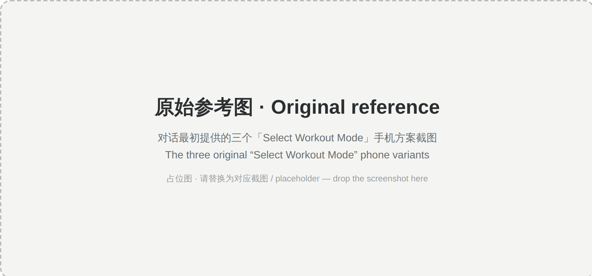

### (b) 中间设计参考图 · Middle reference
课程预览页 + 现有课前弹窗（AI模式 / 录制模式 / 记录模式）。

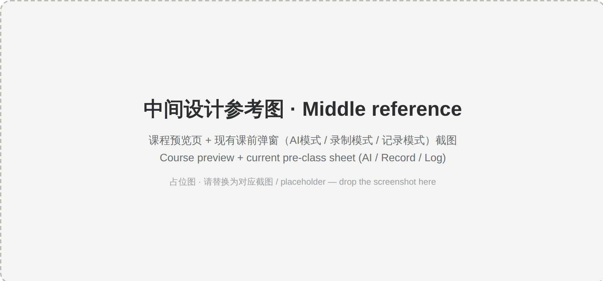

### (c) 最新设计 UI 建议 · Latest design

**手机端 · 已连接 + Plus（选中 Live Coach）**
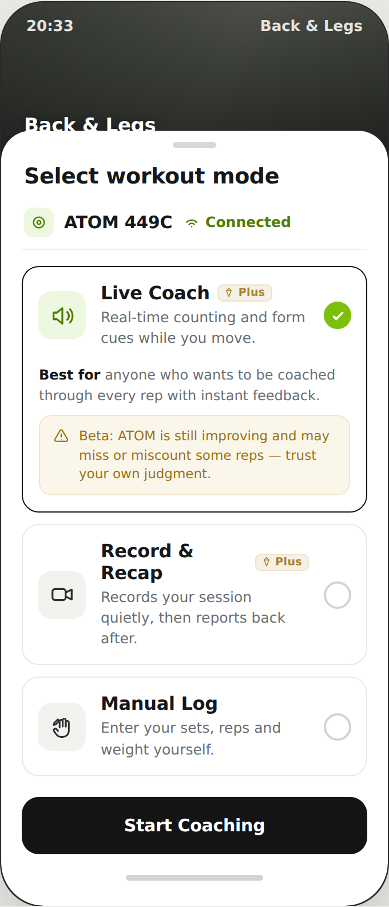

**手机端 · 无设备（AI 模式锁定）**
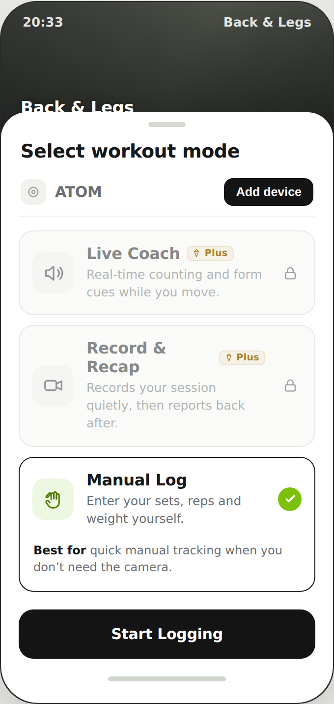

**手机端 · 未开通 Plus（点击后弹说明）**
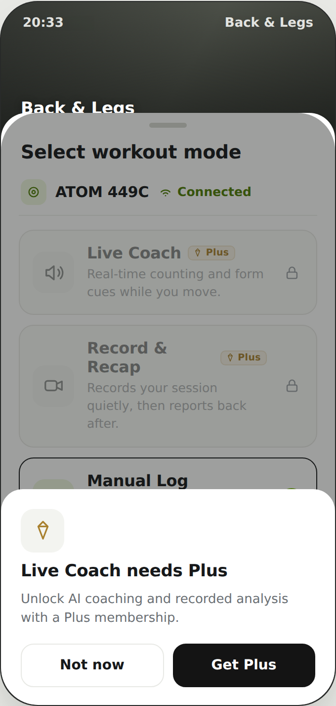

**手机端 · ATOM 无网络（拦截启动）**
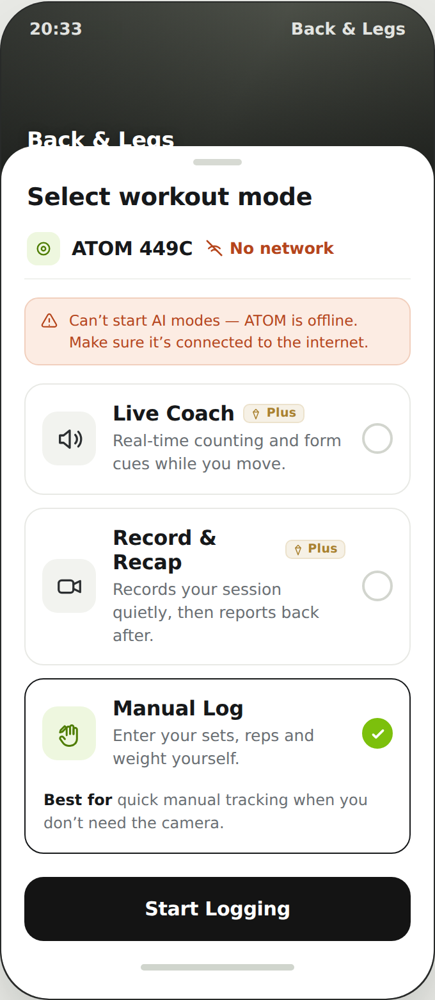

**手机端 · 开始前确认弹窗**
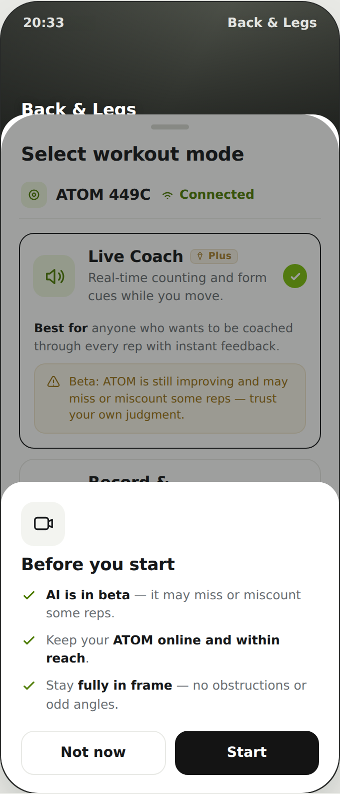

**手机端 · 多设备切换列表**
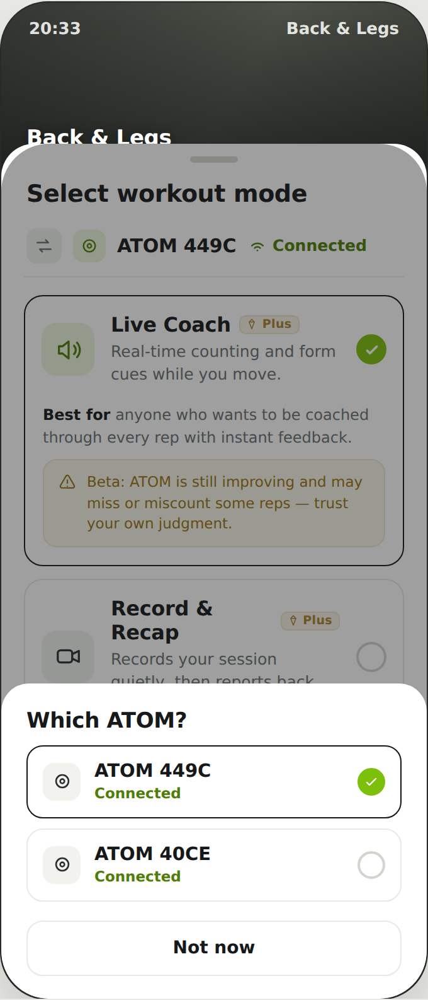

**ATOM 圆屏 · 模式选择**
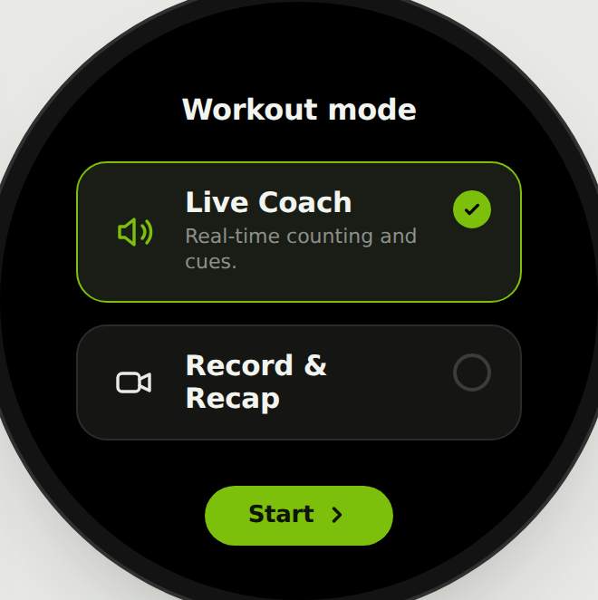

**ATOM 圆屏 · 开始前确认（独立整屏）**
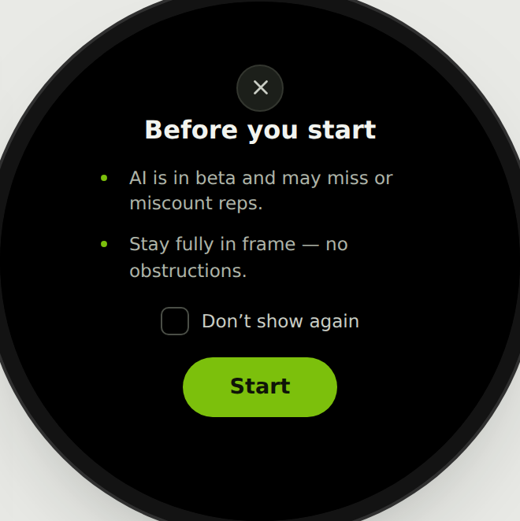

**中文版 · 手机端 / ATOM 圆屏**
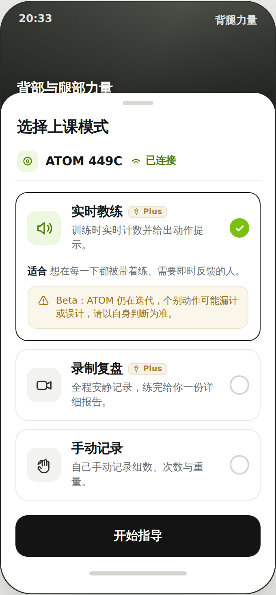
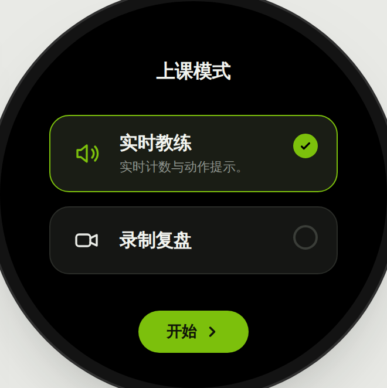

---

## 7. 边界情况 · Edge cases

| 维度 | 状态 | 处理 |
|---|---|---|
| 配对 | 未配对 / 单台 / 多台 | 锁定引导 / 正常 / 列表二次选择 |
| 网络 | 在线 / 无网络 | 可启动 / 拦截并提示 |
| 会员 | 有 / 无 Plus | 正常 / 锁定引导开通 |
| 手动记录 | 任意 | 永远可用，不依赖设备/网络/会员 |

**有意不在此处理**：低电量、固件升级、课中掉线、Plus 课中到期、权限申请（解耦到进入模式后）。

---

## 8. 待定 · Open questions

- 手机端标题行 `Plus` 标签是否保留。
- 品牌绿的确切色值（原型内 `#7cc00c` 为占位近似值，待替换为 BodyPark 品牌色）。
- 是否需要「连接中 / 配对中」过渡态。

---

> 说明：图 (c) 由交互原型 `prototype.html` 截图生成；图 (a)(b) 为占位，请将对话中提供的原始截图替换到 `images/a-original-reference.png`、`images/b-middle-reference.png`。
> Note: (c) rendered from the prototype; (a)(b) are placeholders — replace with the provided screenshots.
